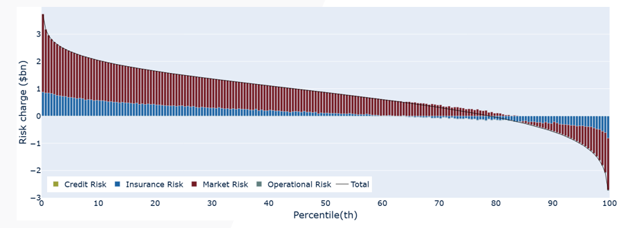
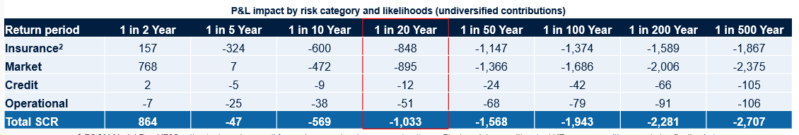
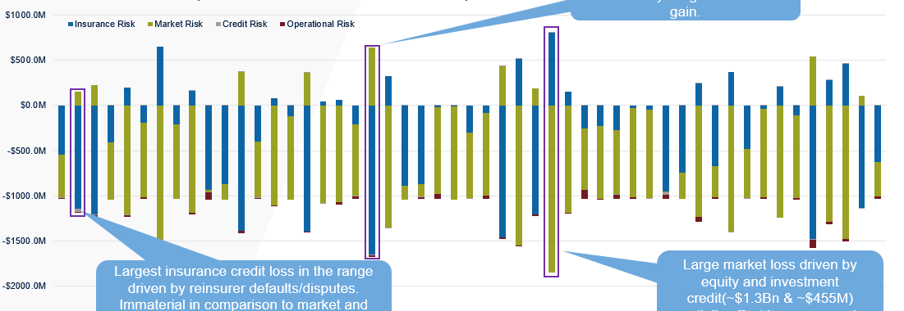
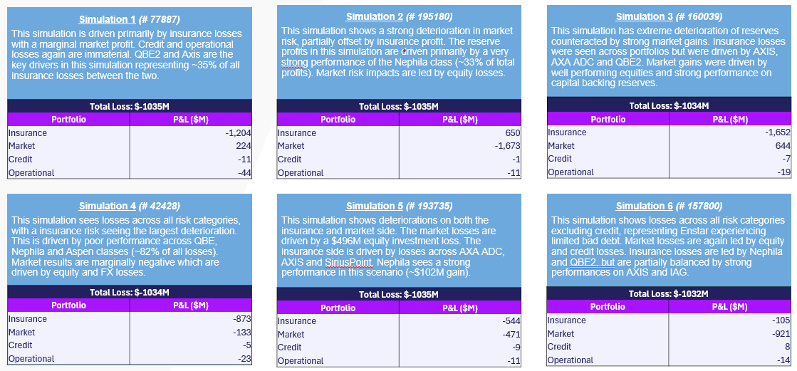
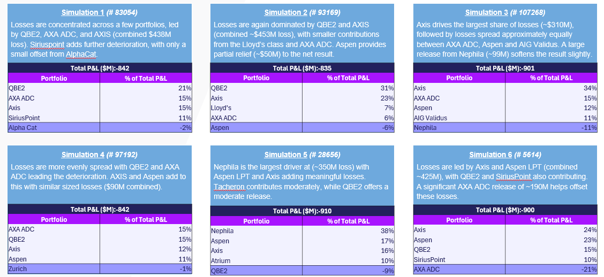

# Documentation for the insurance_lens.py script

## 0. Outputs

This file should output the following for the production of the RAF:

Figure 1 (Total Risk Plot): 
Figure 2 (Total Loss Table): 
Figure 3 (Total Loss Corridor): 
Figure 4 (Total Loss Boxes): 
Figure 5 (Reserve Risk Boxes): 

Data from figures 1-4 is output purely by running `allRisk.py` and data for figure 5 is output by running `reserve_scenarios`.

The formatting of figures 3-5 is best performed in excel, the purpose of this repo is to accurately manupulate and quickly feed through the required data for these figures. 

## 1. Data Requirements and Manual inputs

### 1.1 Manual Inputs

This repository requires minimal manual inputs and the two key scripts here are `reserve_scenarios.py` and `total_risk_exports`. These two will require 'reserve_sim_path' and 'total_risk_path' to be updated. To do so simply left click on the csv containing the sims and click copy as path (or Ctrl+Shift+C) and then paste in place of the existing path.

In `total_risk_exports` the following variables have been left at the top of the script `management_margin`, `enstar_effect` and `num_sims`. These controls have been left in so that the insruance and credit risk buffer calculation can remain updated even when these move around and so that the size of the sim corridor can be easily adjusted for further analysis.

### 1.2 Running the Code

Due to the importation of data for graph plotting only two scripts are required to be run:

a. allRisk.py: Running this will generate the loss table, total risk distribution graph, insurance + credit risk buffer pictured below and `num_sims` simulations around the 95th percentile to plot the simulations corridor in excel.

b. reserve_scenarios: Running this will generate the 50 (or whichever number `num_sims` is selected to be) simulations are around the 95th percentile. 

Between these two scripts all data required for the RAF should be put in seperate Excel files in the Output folders.

## 2. Methodology

### 2.1 Total Risk Exports

This file is not required to be run as it is run through `allRisk.py`. It takes a csv from Igloo, strips out all non `egl_group` inputs and rearranges it into a dataframe for plotting. This data frame is then also used to produce the loss table below the chart (through the quantile function), as well as the total loss corridor (through list splicing).

### 2.2 Reserve Scenarios

This file firstly removes dummy classes used for entity calculations and then combines the Lloyd's and non-Lloyd's versions of QBE2 into a singular class. After doing so it exports any size corridor you chose into Excel. I find the best way to analyse this is to apply a heatmap as this should highlight any sims of partilcular interest.

### 2.3 Plotting software

`allRisk.py` and `generateGraph.py` are both previously audited scripts created by EW. Due to this they have been utilised in this repo in order to maintain proper version control. Both import the variable `df` from `total_risk_exports.py` and this is the only edit that has been made and is also the only link from external scripts.

Map.xlsx is required in the repo to ensure that the proper graph is generated by `allRisk.py`

